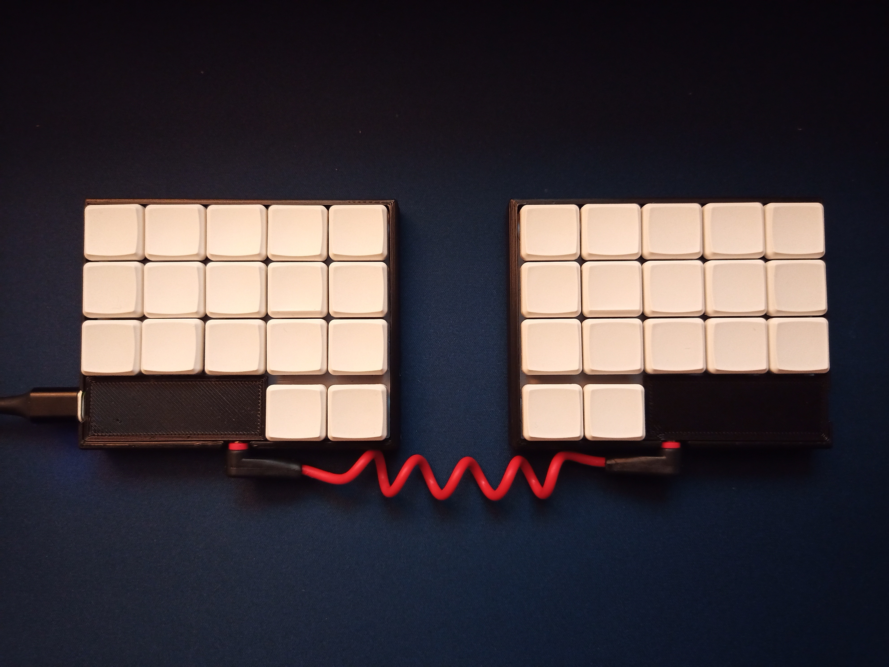
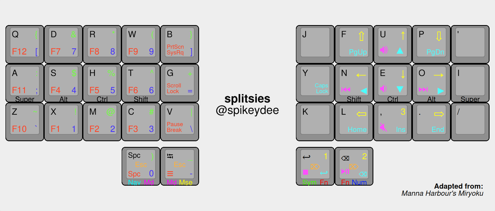
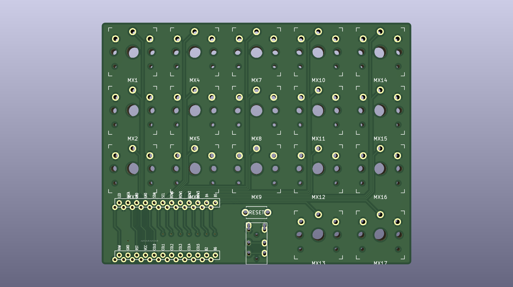
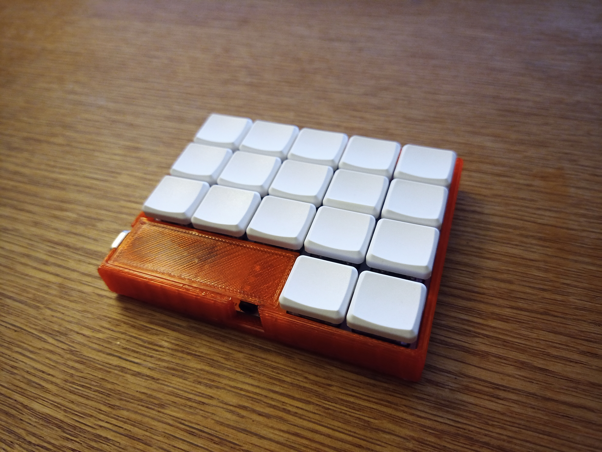
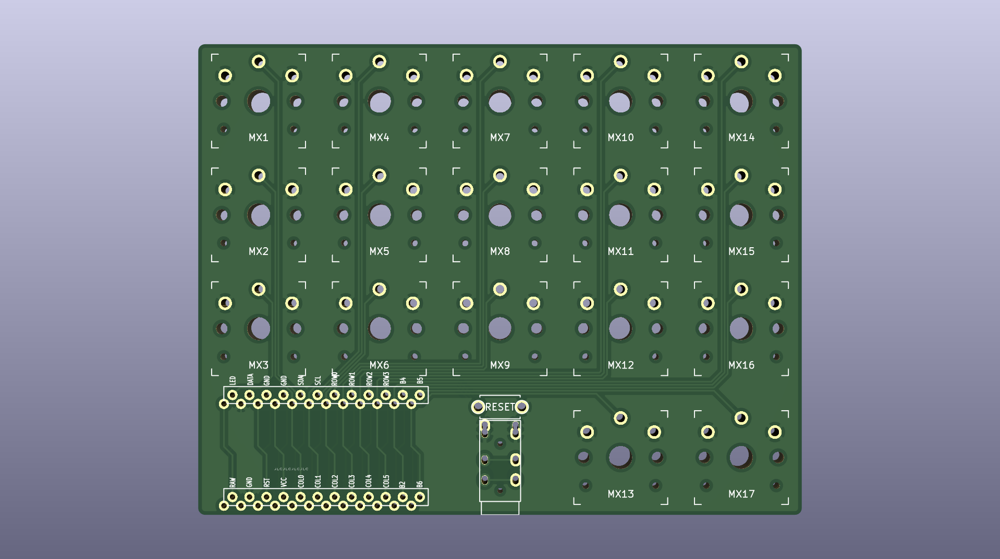
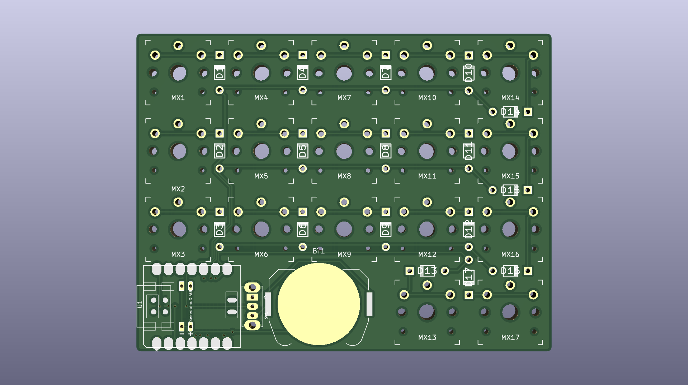
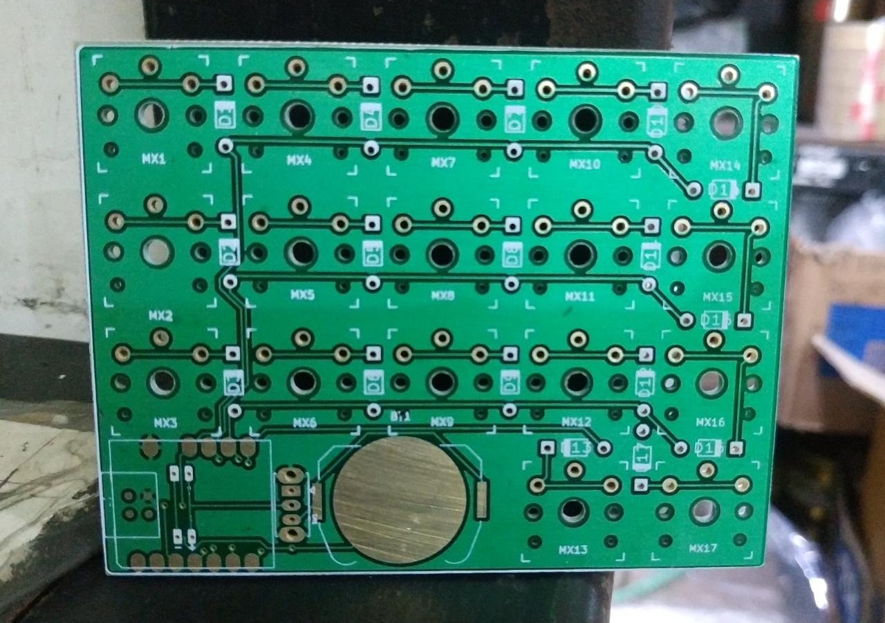
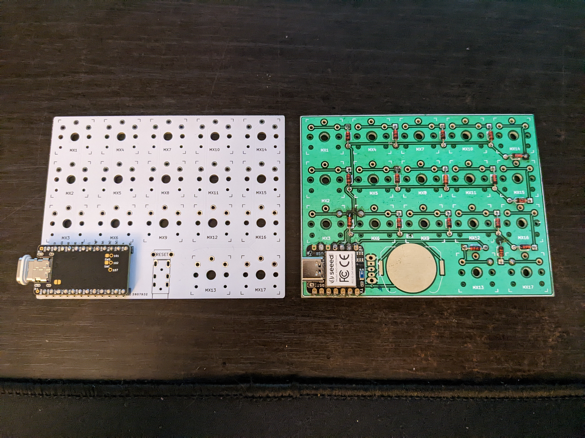

# splitsies

splitsies is a 34-key ortholinear split keyboard with a multi-layered combo-switching keymap. Inspired by @pierrechevalier83's [ferris](https://github.com/pierrechevalier83/ferris), @makenova's [micro-redox-split](https://github.com/makenova/micro_redox/tree/main/micro_redox_split), and @manna-harbor's [miryoku layout](https://github.com/manna-harbour/miryoku/). 

Built around an ortholinear, homerow-centric typing layout, and personally the use of the Workman layout, my splitsies keyboard hopes to achieve a typing workflow with minimum diagonal and horizontal movements of the fingers (minimal finger travel) that hopefully will become more intuitive over time. 

## Overall Features
- THT/soldered only with choc spacing.
- Diodeless
- Reversible PCB & MCU
- I also designed a one-piece, press-fit case that covers the PM (although the PM cover still needs tweaking).

## Required Parts
- 2x Pro Micro microcontroller / anything else with the same footprint
  - It is possible to use a nice!nano as well to make it wireless and rechargeable
- 2x TRRS jacks
- 1x TRRS cable
- 2x Reset switch (optional)

## Layout

Using mostly @manna-harbor's [miryoku layout](https://github.com/manna-harbour/miryoku/), the biggest changes I've made are making the third layer on each side accessible on a 2-key only thumb row through the use of QMK's combos. Where pressing the thumb row keys individually would get you to the first and second layout, pressing both keys at the same time would get you to the tertiary layer of the keymap on the other side of the splitsies keyboard. Minor changes I've made are to the placement of the arrow keys becoming more WASD-like due to preference, a few tweaks to a few more mouse/page navigation buttons (scrolling, page up/down, etc.), and as well as a few key placements the media layer.

## Firmware
- You can find the firmware for the splitsies in my QMK fork dev branch [here](https://github.com/spikeydee/qmk_firmware/tree/spikeydee_dev/keyboards/splitsies/).
- You can also see the my modified miryoku keyboard layout in my userspace [here](https://github.com/spikeydee/qmk_firmware/tree/spikeydee_dev/users/spikeydee).

## Version Differences
I tried my best to prototype each version, following @ruiqimao's [keyboard pcb making guide](https://github.com/ruiqimao/keyboard-pcb-guide). So luckily for most of my iterations, I did not have to rework the traces and footprints at all on KiCad after my first go with ordering them to be made through JLCPCB back then. I'll note albeit the few tweaks I made on each version.

V1 and V2's PCB and case design are good to go (V2 is slightly more compact–therefore is my preferred version) whearas V3 still needs a bit more testing (I'll explain further down below). The 3D printed slip-on case .stl fits both the V1 and V2. 

N.B.: I lost my slide-in case .stl files with the overhanging attached pro micro cover as well as the original with the separated pro micro cover so I need to approximately remake those files in the future.

# V1

I've used split keyboards with thumb buttons a handful of times before (e.g.: microdox, minidox, ferris) but even slightly before using those keyboards, I've been a fan of having an ortholinear layout so I decided I wanted to combine them both. Wanting symmetry, simplicity, and compactness in the design, I opted to make the design reversible, diodeless, and to achieve the smallest footprint possible, I mounted the trrs jack below the third column (and in testing surprisingly does not interfere with typing at all as long as the trrs cable head isn't bulky).

I designed the case to be a slide then press-fit case which has an over-hanging cover for the pro micro where you can take off the supports after printing. I designed the height of the case to be as tall as the keyswitch + keycap's low point when they are pressed down. If the case is still a bit loose then I usually fix that with a bit of hot glue (the image is actually from the version without the attached overhanging PM cover though).

The V1 to me is more of a proof of concept that maybe I could bring all these concepts together into one coherent keyboard, and when I did, if I could get used to the layout and form-factor itself. To me it was a great success in proving all that as since 2021, I've exclusively used the splitsies as my main keyboard and have remembered and gotten used to it's layout & layers after the first few months of using it (although I was already used to the miryoku layout because I used it on other split keyboards before as well). Touch-typing was a non-issue as well because I didn't even have legends on my keycaps since lettered choc keycaps were expensive back then. 

Having a diodeless keyboard made it so that NKRO was a non-issue as well during gaming. I reverted to a toggleable basic WASD layout with the modifier keys on the left since having to re-map everything and also having the modifier keys on the homerow was inconvenient and made most games be practically unplayable.

# V2

The V2 was a much simpler iteration as I gave myself wiggle room of a few milimeters on the footprint of the PCB on the V1, so I just made everything a bit tighter on the V2. I moved the placement slightly on of the MCU and recessed TRRS jacks a bit more as well. The case design didn't really change because the gaps for the microusb port and TRRS jack still aligns with no fitment issues. Visually, the changes aren't that discernable but It gave me a bit more peace of mind that I could make the board footprint more compact.

# V3

For the V3, I wanted to try making a wireless bluetooth version of the splitsies. Back then my budget was tight but time was plentiful, so I opted on trying to use the Seeeduino XIAO BLE microcontroller/ESP32C3 (which also just came out back then in 2022). Wanting to always make the PCB footprint even smaller + out of curiosity and inspiration from @tominabox1's [BLe Chiffre](https://geekhack.org/index.php?topic=111207.0), I decided that I wanted to power the keyboard using a rechargeable coin cell battery as well. Due to the fewer amounts of pins on the microcontroller, I had to go back to using diodes for a row-to-column keyboard matrix setup as I don't think I can handle a keyboard being smaller than 34 keys haha.

As you can see I was able to get the prototype made, but with some glaring issues: 
- I was in Indonesia at the time and wasn't able to order the PCB through JLCPCB like I usually do, so I looked around for local small manufacturers, which I found, but most of them required me to either convert the kicad files to eagle or if I recall correctly they were able to work directly with the .gerber files. I had the readjust the size of the traces and the gaps between them as well due to their machines being unable to print that closely. All was going well but unlike the online printing companies where they know that when there's silkscreen on top of certain pads or components, the local place just straight up put the silkscreen on ALL THE PADS ON THE PCB?!! So I had to scratch a lot of it off to get even a bit of solder to stick to the pads, and by the time I finished soldering the MCU and all the diodes (I had to jump a few traces too since I decimated some in the process of silkscreen scratching), I was able to barely program ZMK to work with the keyboard and was too frustrated to even keep going...

I didn't get to updating the case yet for this design because I wasn't able to follow through with finishing the keyboard yet as mentioned above. I uploaded the KiCad files for the original V3 and not the one adjusted for the indonesian place's parameters.

## Additional Remarks + Future Plans

While we're on the subject of wireless: Later on I tried again but on the V2 using a nice!nano, but I wasn't able to get it working using ZMK, since at that time they didn't have that much documentation for custom diodeless keyboard support + I wasn't technically savvy enough to figure it out on my own :\ + wiring and soldering batteries scared the heck out of me too back then HAHA.

I'm hoping I could get the V2 with the nice!nano and the V3 working some time in the future, remaking my 3d printed old case design,and designing + printing a nice machined metal/aluminum case for it too so that I can have a portable, rechargeable, and robust custom keyboard that suits my preferences exactly.
